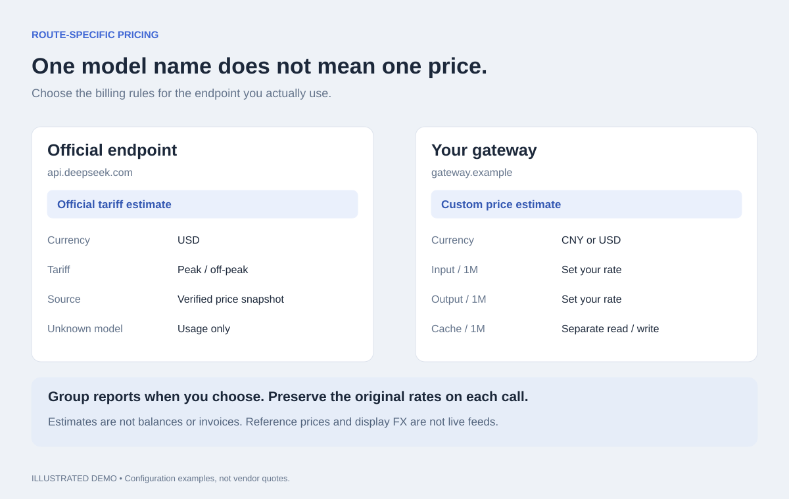

# API Ledger for DSH

[English](#english) · [简体中文](#简体中文) · [中文完整文档](README.zh.md)

**See what this conversation costs, without leaving it.**

API Ledger brings token usage and estimated API spend into DeepSeek Harness: a full conversation report, a settings dashboard, a compact composer total, and a one-line daily total in the sidebar.


*Illustrated feature overview with sample data, not a screenshot of a live account.*

## English

### Why use it?

If your workflow involves switching between API routes or opening a separate report to check costs, these are the features to look at:

- **Costs where you work.** Session spend below the composer; today's spend in the sidebar. Click the daily total to open the full settings report.
- **Same model, different prices.** Pricing is keyed by route and model. An official endpoint and a gateway can have different rates without contaminating each other's estimates.
- **Group deliberately.** Routes remain separate by default. Give them the same billing group to combine their reports; a shared key reference never silently combines accounts or implies shared balance.
- **Two currencies, one consistent view.** CNY/USD display selection is remembered and shared across all four views.
- **Make estimates explainable.** Recent calls show their pricing source. Unknown prices stay unpriced rather than looking free, and historical records retain the rates originally used.
- **No separate dashboard service.** Usage capture and preferences live locally in the plugin. It does not read API key values or upload ledger data to a plugin-owned service.

These are concrete workflow benefits, not a claim that other usage plugins lack them. This plugin measures recorded usage and estimates cost; it does not retrieve provider invoices or account balances.

### Four views

| View | What it answers |
| --- | --- |
| Conversation → API Ledger | What has this conversation cost? Recent calls, model costs, token composition and usage trends. |
| Settings → API Ledger | Where does spending go across conversations? Date ranges, today/yesterday comparison and pricing preferences. |
| Below the composer | How much has this session used so far? |
| Sidebar footer | How much have I used today? One line, with a click through to settings. |



*Illustration of route-specific pricing. Example gateway rates are arbitrary, not vendor quotes.*

### Install

Requires Node.js 20+ and a compatible DSH installation. Tested with DSH Desktop 2.0.13 / bundled DSH 0.1.5-rc.2. No build step or runtime npm dependencies.

**DSH Desktop — GitHub installation**

```sh
git clone https://github.com/LAwLi3tCoding/dsh-api-ledger.git
cd dsh-api-ledger
node scripts/install.mjs
```

Restart DSH Desktop. Open **Settings → API Ledger**, or the **API Ledger** tab in a conversation. Keep the cloned folder: installation links to it. Update with `git pull`, then restart. Uninstall this linked installation with `node scripts/install.mjs --uninstall`.

**DSH CLI — a CLI-managed profile**

```sh
# From GitHub
dsh plugin --profile web add github:LAwLi3tCoding/dsh-api-ledger

# From npm, after the release is available
dsh plugin --profile web add dsh-api-ledger
```

Replace `web` with your CLI-managed profile. DSH 0.1.5-rc.2 reserves `desktop` for Electron, so `dsh plugin --profile desktop add ...` is rejected. Use the desktop installation above or the desktop marketplace once the listing is merged; marketplace submission is not the same as availability.

### Configure pricing

Open **Settings → API Ledger → Accounts and pricing**. Select a route and model; save before switching models.

| Mode | Behavior |
| --- | --- |
| Official tariff estimate | Default for recognized DeepSeek official endpoints without an explicit override. Applies the bundled USD tariff and peak/off-peak rules. |
| Reference estimate | Explicit opt-in to a fixed DeepSeek off-peak USD snapshot. Does not adjust for time or holidays. |
| Custom price estimate | Set currency and prices per million tokens: uncached input, output, cache read and cache write. Zero is valid. |
| Usage only | Record tokens without inventing a cost. Default for other endpoints. |

Official endpoint detection checks the effective URL, including the DeepSeek adapter's launch-environment override. A route's name alone never establishes official pricing. The bundled [official price snapshot](https://api-docs.deepseek.com/quick_start/pricing/) was verified on **2026-09-21**. It supports `deepseek-flash`, `deepseek-v4-flash`, `deepseek-v4-flash-vision-exp` and `deepseek-v4-pro`. Peak selection uses request start time and the [2026 Chinese holiday calendar](https://www.gov.cn/zhengce/zhengceku/202511/content_7047091.htm). Unsupported models or calendar years remain unpriced. Prices update with plugin releases, not through a live pricing API.

Names and groups affect the current report presentation. Price edits affect future calls only. Existing custom preferences survive upgrades. Reset/delete removes ledger preferences for that route, not DSH model settings or historical calls. Inactive routes are grouped separately; preference-only routes disappear when removed.

### Accuracy and data boundaries

- CNY/USD is **display conversion**, using fixed `1 CNY = 0.14 USD`; it is not a live exchange rate or a provider's currency settlement rate.
- A call is recorded when it ends and supplies usage. Views refresh every 10 seconds while visible; today follows the client calendar.
- Costs are **estimates**, not invoices, remaining balances, budgets or subscription charges. Partially priced totals include only known costs.
- Historical calls keep original amounts and rates. A warning flags legacy USD numbers possibly labelled as CNY; it does not rewrite them.
- Uncached input and cache tokens are separate buckets. Reasoning tokens are not charged a second time. Adapters must report compatible normalized usage.
- Calls before installation are not imported. Missing usage cannot be reconstructed; the running process shows a missing-usage count. Nested wrappers are deduplicated, but an outer call that fans out to multiple upstream streams can still undercount.
- Preferences are stored in `$DSH_HOME/api-ledger/config.json`; records in `records.jsonl`, with `rollup.json` as a derived summary. Without `DSH_HOME`, use `~/.dsh/api-ledger/`. These local files and credentials are not part of the package. In-memory history is capped at the latest 200,000 records.

### Development

```sh
npm run check
npm test
npm pack --dry-run
```

Tests exercise pricing boundaries, endpoint recognition, immutable historical amounts, configuration conflicts, same-origin writes, stream capture, report periods, bilingual UI and the four display slots. See [issues](https://github.com/LAwLi3tCoding/dsh-api-ledger/issues) for bug reports; share anonymized examples rather than API keys or private session logs.

License: [MIT](LICENSE).

---

## 简体中文

**不用离开会话，就能查看本次对话花了多少钱。**

API 账本把 Token 用量和 API 估算费用放进 DSH：会话完整报告、设置页总览、输入框下方的会话金额，以及左下角的一行今日金额。

### 哪些地方用起来方便？

- **随手查看费用**：不用频繁打开独立报表；会话费用放在输入框下面，今日费用放在侧边栏，点击即可打开设置中的账本。
- **相同模型可以按不同接口计价**：价格按「路由 + 模型」配置，官方接口和企业网关互不混用。
- **分组由使用者决定**：默认按路由分别统计，需要时再设置相同账单分组。不会因为共用凭据引用就自动合并，也不会把展示分组当作共用余额。
- **四处展示同步切换币种**：CNY/USD 选择会保存并同步，避免不同页面各用一种显示币种。
- **能看懂费用怎么来的**：最近调用标明计价来源，未配置单价显示未计价，历史记录保留当时使用的单价。
- **无需部署额外服务**：用量与配置保存在本机，不读取 API Key 的值，也不上传到插件自建的统计服务。

这些是插件的具体使用价值，不代表其他用量插件都不具备相同能力。这里统计的是已记录用量与估算费用，不是供应商账单或账户余额。

### 四处展示

| 位置 | 用途 |
| --- | --- |
| 会话 → API 账本 | 本会话费用、最近调用、模型分布、Token 构成和用量趋势 |
| 设置 → API 账本 | 跨会话报表、周期筛选、今日／昨日对比、账户与计价 |
| 会话输入框下方 | 本会话已用金额 |
| 侧边栏左下角 | 单行今日费用，点击打开账本设置 |

### 安装

需要 Node.js 20+ 和兼容的 DSH。已在 DSH Desktop 2.0.13／内置 DSH 0.1.5-rc.2 验证；插件无需构建，没有运行时 npm 依赖。

**DSH Desktop：从 GitHub 安装**

```sh
git clone https://github.com/LAwLi3tCoding/dsh-api-ledger.git
cd dsh-api-ledger
node scripts/install.mjs
```

重启 DSH 后，打开「设置 → API 账本」或会话的「API 账本」Tab。安装使用本地链接，请保留克隆目录。更新时执行 `git pull` 后重启；卸载该链接安装时执行 `node scripts/install.mjs --uninstall`。

**DSH CLI：安装到 CLI 管理的 profile**

```sh
# GitHub 安装
dsh plugin --profile web add github:LAwLi3tCoding/dsh-api-ledger

# npm 版本发布后可使用
dsh plugin --profile web add dsh-api-ledger
```

将 `web` 换成自己的 CLI profile。DSH 0.1.5-rc.2 的 `desktop` profile 由 Electron 专管，不能直接使用 `dsh plugin --profile desktop add ...`。桌面端请使用上面的安装脚本，或在市场收录完成后通过桌面市场安装；提交 PR 不等于已经上架。

### 配置计价

打开「设置 → API 账本 → 账户与计价」，选择路由和模型。每个模型单独保存，切换前先保存当前修改。

| 方式 | 含义 |
| --- | --- |
| 官方价表估算 | 已识别的 DeepSeek 官方直连在没有显式配置时默认使用，按内置 USD 价表及峰谷规则估算 |
| 参考价估算 | 手动选择固定的官方非高峰 USD 快照，不判断时间和节假日 |
| 自定义单价 | 按每百万 Token 填写非缓存输入、输出、缓存读和缓存写价格及币种；允许零价格 |
| 仅记录用量 | 不猜测费用；其他接口的默认方式 |

官方接口按实际 URL 识别，并考虑 DeepSeek 适配器的启动环境覆盖；名称包含 DeepSeek 不代表官方直连。内置[官方价表](https://api-docs.deepseek.com/quick_start/pricing/)核验日期为 **2026-09-21**，支持 `deepseek-flash`、`deepseek-v4-flash`、`deepseek-v4-flash-vision-exp` 和 `deepseek-v4-pro`。按请求开始时间及 [2026 年中国节假日](https://www.gov.cn/zhengce/zhengceku/202511/content_7047091.htm)判断峰谷；未知模型或其他日历年份仅记录用量。价表随插件版本更新，并非实时拉取。

名称与分组调整会更新历史报表的展示，修改单价只影响后续调用。已有自定义配置不会被升级覆盖。重置／删除账本配置保留 DSH 模型配置与历史调用。历史及停用路由单独折叠展示；只有账本配置、没有历史和当前模型配置的路由，删除后会从列表消失。

### 统计边界与本地数据

- CNY/USD 是**展示折算**，固定使用 `1 CNY = 0.14 USD`，不是实时汇率，也不是供应商的币种结算比例。
- 调用结束并上报用量后计入；页面可见时每 10 秒刷新。「今日」按客户端本地日历计算。
- 金额是**估算费用**，不是官方账单、余额、预算或订阅扣费。部分调用未计价时，只汇总已知费用。
- 历史金额和原始单价不变。疑似将 USD 数字标成 CNY 的旧记录会显示提示，不自动重算。
- 非缓存输入与缓存 Token 分开计价，推理 Token 不重复累加；适配器需要提供兼容的标准化用量。
- 安装前的调用不补录。缺失用量无法恢复，当前进程会显示缺失次数。嵌套调用会去重，但一个外层调用扇出多个上游流仍可能漏计。
- 配置位于 `$DSH_HOME/api-ledger/config.json`；逐次记录保存在 `records.jsonl`，`rollup.json` 为派生汇总。未设置 `DSH_HOME` 时使用 `~/.dsh/api-ledger/`。这些本地数据及凭据不随插件分发。内存最多保留最近 200,000 条记录。

### 开发与反馈

```sh
npm run check
npm test
npm pack --dry-run
```

测试覆盖计价边界、官方接口识别、历史金额不变、配置冲突、同源写入、流式捕获、报表周期、双语与四处展示。问题请提交到 [Issues](https://github.com/LAwLi3tCoding/dsh-api-ledger/issues)，使用匿名示例，不要上传 API Key 或私人会话日志。

许可证：[MIT](LICENSE)。
